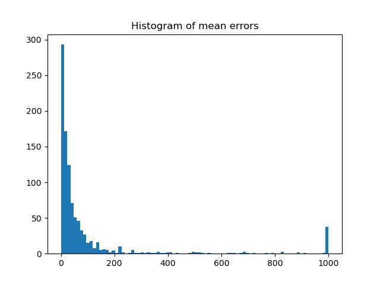
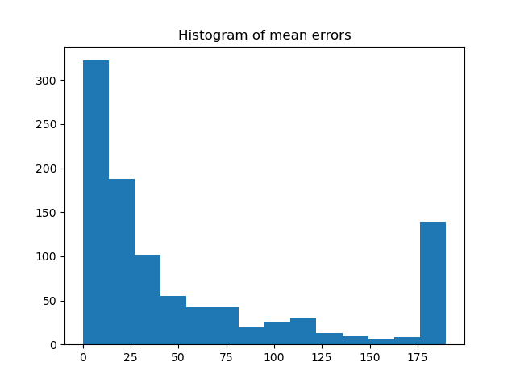
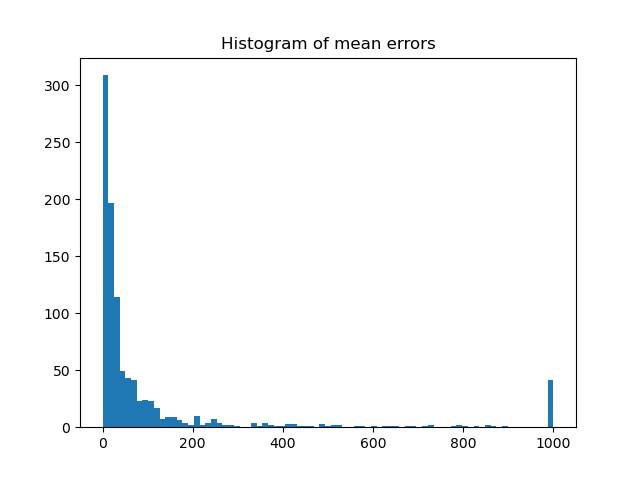
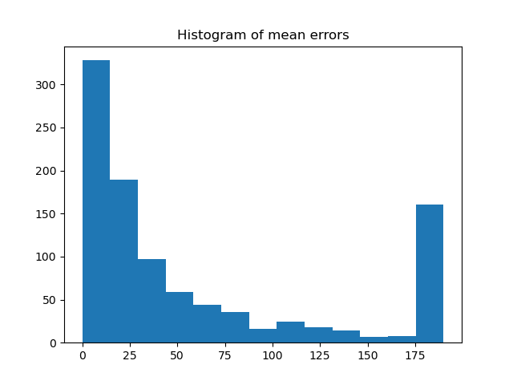

# search_engine

### Instalação

Recomendamos que a instalação seja feita automaticamente via ``docker-compose`` para
que não haja problemas com dependências e compatibilidade com a versão do Python:
```
docker-compose up --build
```

Caso não queira/possa usar o ``docker``, lembre-se de que é preciso instalar primeiro
as dependências antes de executar o programa principal. Recomendamos que isso seja
feito em um [ambiente virtual](https://docs.python.org/3/library/venv.html) e que
a versão do seu Python seja pelo menos 3.7+. Depois que seu ambiente estiver
configurado, basta executar:
```
pip install --upgrade pip
pip install -r requirements.txt
```


#### Testes

Para rodar testes unitários específicos de um módulo, execute **um** dos seguintes comandos:
```
python -m unittest tests/test_indexer.py
python -m unittest tests/test_searcher.py
python -m unittest tests/test_evaluator.py
```

Para executar todos os testes de uma só vez:
```
python -m unittest discover
```

### Execução

Foi criada uma simples CLI (simples mesmo) para interação com a *engine*. Você pode
acessar essa interface a partir do script ``main.py``:
```
python main.py
``` 
Ao executá-lo, o motor de busca irá lhe perguntar se você deseja carregar o dataset
padrão ou outro de sua escolha. Pressione enter para selecionar a opção padrão.

Se você está executando o motor pela primeira vez, será necessário indexar o
dataset em alguns índices para otimizar o serviço de busca. Isso é feito apenas uma
única vez e um arquivo binário com estruturas otimizadas é salvo no diretório
``data/seu_dataset_processed.npz`` para uma leitura rápida dos índices em eventuais
execuções futuras.

Depois disso, você poderá escolher se deseja fazer *queries* livremente na
*engine* (padrão) ou um módulo avaliador que gera estatísticas sobre o
comportamento do motor. Para isso entre com uma das opções:
```
search engine
``` 
para fazer suas buscas ou, para fazer a avaliação:
```
evaluator
```

No modo de buscas, você pode também passar parâmetros para filtrar os
resultados da sua requisição. Para ver quais são esses parâmetros, digite ``-o``.
No modo de avaliação, o único parâmetro suportado é o número de requisições
aleatórias que devem ser feitas para gerar as estatísticas.

Para sair a qualquer momento, digite ``-q``. Note também que esta CLI
tem apenas o objetivo de ser uma prova de conceito, então ela não avalia
a consistência da entrada, portanto cuidado com parâmetros inválidos. Além disso,
a *engine* apenas retorna os IDs dos produtos. Embora uma opção
para visualização do conteúdo dos produtos não tenha sido implementada, essa
informação está armazenada em uma estrutura do módulo ``indexer``.


### Avaliação

A avaliação foi feita utilizando duas condições -- com e sem *features* não textuais -- e
sob dois cenários distintos: limitando o número de produtos retornados a 190 (número máximo
na escala transformada da posição do item) e outro a 1000. Para cada configuração, foram
feitas 1000 requisições aleatórias à *engine* extraídas do dataset fornecido.
Para cada requisição, armazenamos a diferença entre a posição esperada do produto no
ranqueamento para a posição em que de fato a *engine* o devolveu.

##### Número de itens retornados: 1000
* **Apenas texto**:
    * Erro médio (RMSE): 239.2835
    * Desvio padrão: +- 217.3504
* **Com features adicionais**:
    * Erro médio (RMSE): 248.1454
    * Desvio padrão: +- 224.0959

##### Número de itens retornados: 190
* **Apenas texto**:
    * Erro médio (RMSE): 85.4358
    * Desvio padrão: +- 64.0261
* **Com features adicionais**:
    * Erro médio (RMSE): 89.0862
    * Desvio padrão: +- 66.4275

Olhando apenas os resultados de erro médio, não é possível ter uma ideia muito clara de
como o algoritmo está efetivamente se comportando. Por isso, adicionamos os histogramas
abaixo para entendermos qual a distribuição desses erros.

Como podemos observar, o erro médio foi fortemente impactado por uma porcentagem significativa
de produtos que ou não foram encontrados ou não estavam dentro do limite de items retornados.
De todo modo, rodando um *one-way ANOVA*, não houve diferença estatisticamente significativa 
entre nenhuma condição, seja no caso de 1000 itens retornados (F=0.3014, p=0.583), 
seja no de 190 (F=0.1501, p=0.698). Já os histogramas indicam que ambas as versões do algoritmo 
concentram seus erros mais próximos de 0 (o que é o desejável): 

|              | 1000 itens | 190 itens  |   
|--------------|------------|------------|
| apenas texto |||
| com features |||

Ainda assim, a indexação TF-IDF com busca via similaridade por cossenos não parece ser 
a mais adequada para o tipo de comportamento esperado pelo dataset. Como o volume de texto 
por produto é relativamente baixo e bastante variável, a frequência de um termo talvez não
tenha tanto peso e um dos fenômenos observados é que itens com descrições muito curta 
podem ser mais penalizados se a requisição conter muitos termos. 


### Limitações importantes

Há diversas simplificações no modelo. Para começar, não foi empregada lematização em português,
apenas stemming, o que provavelmente introduz erros de representatividade do índice, já que
podemos armazenar prefixos aparentemente distintos que pertencem à mesma raiz
(e.g. "abriu" -> "abr", "aberto" -> "abert").

Como cardinalidade é importante para métricas na avaliação do modelo, simplificamos o domínio-alvo
aglutinando os campos "search_page" e "position" em uma única dimensão de espaço discreto = [1, 190].
Porém é importante ressaltar que muitas vezes é possível que um item no topo na segunda página
do resultado de busca tenha mais visibilidade que outro no fundo da primeira página.
Esta simplificação, portanto, não comporta essa possibilidade.